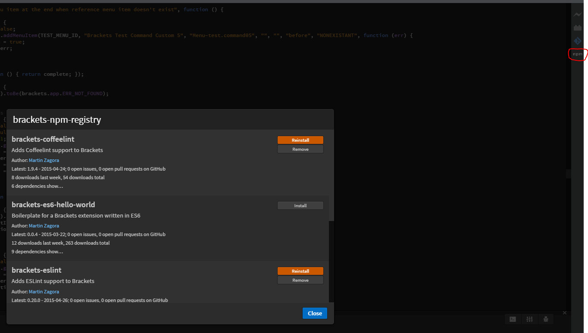

[![NPM version][npm-image]][npm-url]
[![Build status][travis-image]][travis-url]
[![Downloads][downloads-image]][downloads-url]

# brackets-npm-registry

Extension to install other extensions with npm

## How to install brackets-npm-registry

It's recommended to have [node.js](https://nodejs.org/) or [io.js](https://iojs.org/) installed.

### mac

```
cd ~/Library/Application\ Support/Brackets/extensions/user/
git clone https://github.com/seawin/brackets-npm-registry.git brackets-npm-registry
cd brackets-npm-registry
npm install
```

### windows

```
cd /D %HOMEDRIVE%%HOMEPATH%\AppData\Roaming\Brackets\extensions\user
git clone https://github.com/seawin/brackets-npm-registry.git brackets-npm-registry
cd brackets-npm-registry
npm install
```

### linux

```
cd ~/.config/Brackets/extensions/user
git clone https://github.com/seawin/brackets-npm-registry.git brackets-npm-registry
cd brackets-npm-registry
npm install
```
## Extra：for Chinese
1、进入brackets插件目录：Show Extensions Floder

`
windows：
  cd /D %HOMEDRIVE%%HOMEPATH%\AppData\Roaming\Brackets\extensions\user
linux：
  cd ~/.config/Brackets/extensions/user
mac：
  cd ~/Library/Application\ Support/Brackets/extensions/user/
`

2、下载文件到当前文件夹：git clone \<url> \<re_name>

	git clone https://github.com/seawin/brackets-npm-registry.git brackets-npm-registry
  
3、进入下载文件夹内：cd \<re_name>

	cd brackets-npm-registry
  
4、通过npm安装
#####   !!! 如果没有插件图标，可能就是没有这一步骤


	npm install
  

## How to use brackets-npm-registry

You'll get a new icon in the right toolbar to open this extensions registry.



## How to upload extensions so the brackets-npm-registry is able to find them

- package.json needs to have `"brackets-extension"` defined in `"keywords"`
- package.json needs to have `"brackets": "<version>"` defined in `"engines"`
- see sample [package.json](https://github.com/zaggino/brackets-es6-hello-world/blob/master/package.json)
- use `npm publish` to upload the extension to the npm
- installation works in the same way `npm install` does, all dependencies are downloaded and `install` script is executed

## How to hack on brackets-npm-registry

This extension is written in ES6, so you'll need a few handy gulp tasks when doing any modifications to it.

### gulp tasks

`gulp build` - build your ES6 files into ES5 so Brackets is able to run them

`gulp watch` - watch files for changes and compile them as you work

`gulp test` - lint your sources with ESLint

[npm-image]: https://img.shields.io/npm/v/brackets-npm-registry.svg?style=flat-square
[npm-url]: https://npmjs.org/package/brackets-npm-registry
[travis-image]: https://img.shields.io/travis/zaggino/brackets-npm-registry/master.svg?style=flat-square
[travis-url]: https://travis-ci.org/zaggino/brackets-npm-registry
[downloads-image]: http://img.shields.io/npm/dm/brackets-npm-registry.svg?style=flat-square
[downloads-url]: https://npmjs.org/package/brackets-npm-registry
